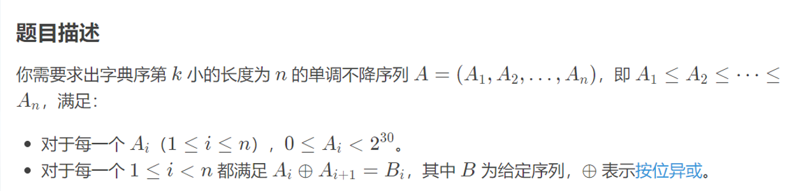
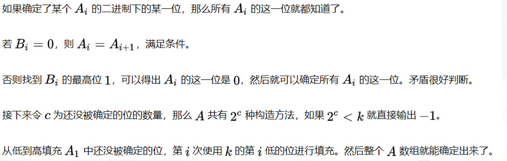

## 技巧

- 拆位
- 公式

## 牛客第七场 C Beautiful Sequence

[题目链接](https://ac.nowcoder.com/acm/contest/57361/C)





```cpp
#include <bits/stdc++.h>

#define LL long long
#define ULL unsigned long long
#define x first
#define y second

using namespace std;

typedef pair<int, int> PII;
typedef pair<LL, LL> PLL;

const int INF = 0x3f3f3f3f;

void solve()
{
    int n, k;
    cin >> n >> k;

    vector<int> b(n + 1), w(n + 1);
    for (int i = 1; i < n; i++)
    {
        cin >> b[i];
        w[i + 1] = w[i] ^ b[i];
    }

    vector<int> a1(30, -1);
    for (int i = 1; i < n; i++)
    {
        int u = -1;

        for (int j = 29; j >= 0; j--)
            if ((b[i] >> j) & 1)
            {
                u = j;
                break;
            }

        // 当 Bi == 0 的时候直接跳过即可
        if (u == -1)
            continue;
        // ==>  a[i]的第u位为0
        // ==>  a[1]的第u位为t

        int t1 = ((w[i] >> u) & 1) ^ 0;

        if (a1[u] != -1 && a1[u] != t1)
        {
            cout << "-1" << endl;
            return;
        }
        else
            a1[u] = t1;
    }

    // for (int i = 29; i >= 0; i--)
    //     cerr << a1[i] << endl;

    int cnt = 0;
    for (int i = 0; i < a1.size(); i++)
        if (a1[i] == -1)
            cnt++;

    if (pow(2, cnt) < k)
    {
        cout << "-1" << endl;
        return;
    }
    k--;
    while (k)
    {
        int c = k & 1;
        k >>= 1;
        for (int i = 0; i <= 29; i++)
            if (a1[i] == -1)
            {
                a1[i] = c;
                break;
            }
    }

    int ans = 0;
    for (int i = 29; i >= 0; i--)
        if (a1[i] == -1)
            a1[i] = 0;
    for (int i = 29; i >= 0; i--)
        ans = ans * 2 + a1[i];

    cout << ans << " ";
    for (int i = 2; i <= n; i++)
    {
        cout << (ans ^ w[i]) << " \n"[i == n];
    }
    return;
}

int main()
{
    ios::sync_with_stdio(false);
    cin.tie(0), cout.tie(0);

    int t;
    cin >> t;
    while (t--)
    {
        solve();
    }

    return 0;
}
```