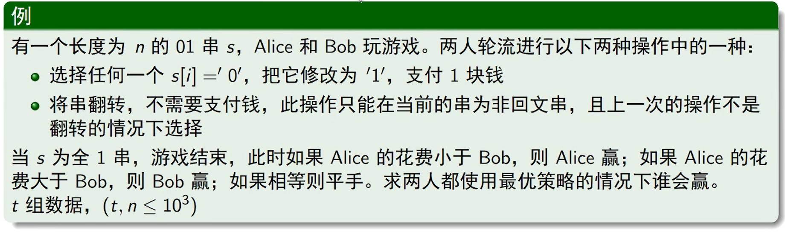
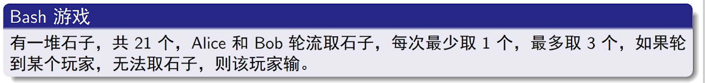
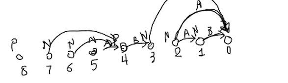
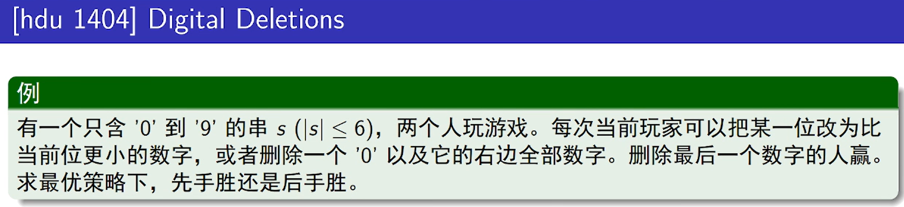

# 4.博弈论

**CF 1527 B2**




**组合游戏**

- 两个玩家
- 一个状态集合
- 游戏规则是指明玩家在一个状态下可以移动到哪些其他状态
- 玩家轮流进行移动
- 如果当前处于某个状态，玩家根据规则无法移动，则游戏结束
  - 状态图为**有向无环图**
- （大部分时候）无论玩家如何选择，游戏都会在有限步之内结束


**关于组合游戏的通用方法**

找到这个游戏的所有状态的P状态(Previous position)和N状态(Next position)


当前玩家：处于这个状态并且往后走

P状态 =>   走到这个状态的人会赢  => 当前玩家会输

N状态 => 从这个状态走出去的人会赢 => 当前玩家会赢


从结束的状态往回推


步骤：

- 结束状态是 P or N

- 一个状态可以走到P状态，这个状态就是N状态
- 一个状态无法走到P状态，只能走到N状态，这个状态就是P状态


推得最初状态 

如果是P，则先手会输

如果是N，则先手会赢


**Bash 游戏**

是一个组合游戏






 

题目：

<https://vjudge.net/problem/HDU-1404>




每一次操作后数肯定是变小的 => 所以可以从 sg[0] 推到 sg[N]


如果 sg[i] == 0，表示 i 状态必败 => 则每一个到 i 的状态都是必胜的 => 反着推即可


```cpp
#include <iostream>
#include <algorithm>
#include <cstring>

#define LL long long
#define ULL unsigned long long
#define x first
#define y second

using namespace std;

typedef pair<int, int> PII;
typedef pair<LL, LL> PLL;

const int INF = 0x3f3f3f3f;
const int N = 1000010;

int sg[N];

int getlen(int x)
{
    int res = 1;
    x /= 10;
    while (x)
    {
        x /= 10;
        res++;
    }
    return res;
}

void extend(int n)
{
    int len = getlen(n);
    if (len >= 7)
        return;
    for (int i = 0, base = 1; i < len; i++, base *= 10)
    {
        int x = n;
        int t = (x % (10 * base)) / base;
        x -= t * base;
        for (int j = t + 1; j <= 9; j++)
        {
            int k = x + j * base;
            sg[k] = 1;
        }
    }

    if (len < 6)
    {
        int base = 1;
        int x = n;
        while (getlen(x) < 6)
        {
            x *= 10;
            for (int i = 0; i < base; i++)
                sg[x + i] = 1;
            base *= 10;
        }
    }
}

int main()
{
    // ios::sync_with_stdio(false);
    // cin.tie(0), cout.tie(0);

    // sg[i] == 0 表示先手必败
    sg[0] = 1;
    for (int i = 1; i < 1000000; i++)
    {
        if (!sg[i])
            extend(i);
    }

    char str[10];
    while (scanf("%s", str) != EOF)
    {
        if (str[0] == '0')
        {
            printf("Yes\n");
            continue;
        }
        int n = 0, i;
        for (i = 0; i < strlen(str); i++)
            n = n * 10 + str[i] - '0';
        if (sg[n])
            printf("Yes\n");
        else
            printf("No\n");
    }

    return 0;
}
```


