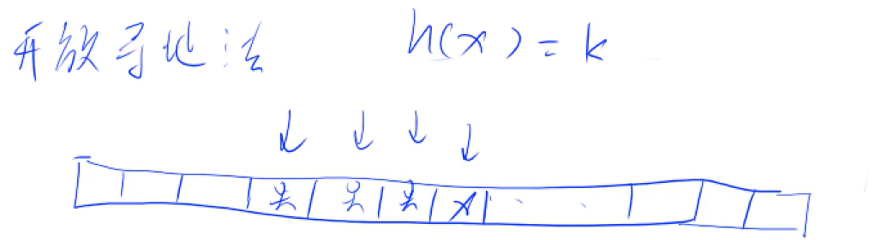
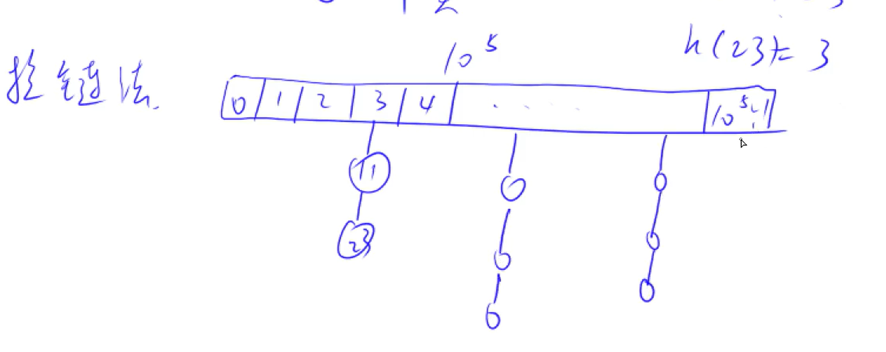
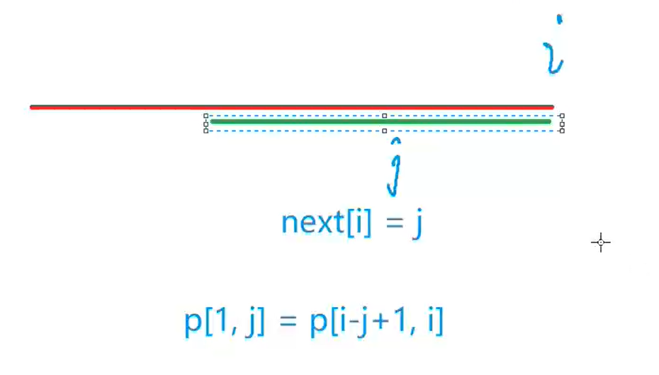
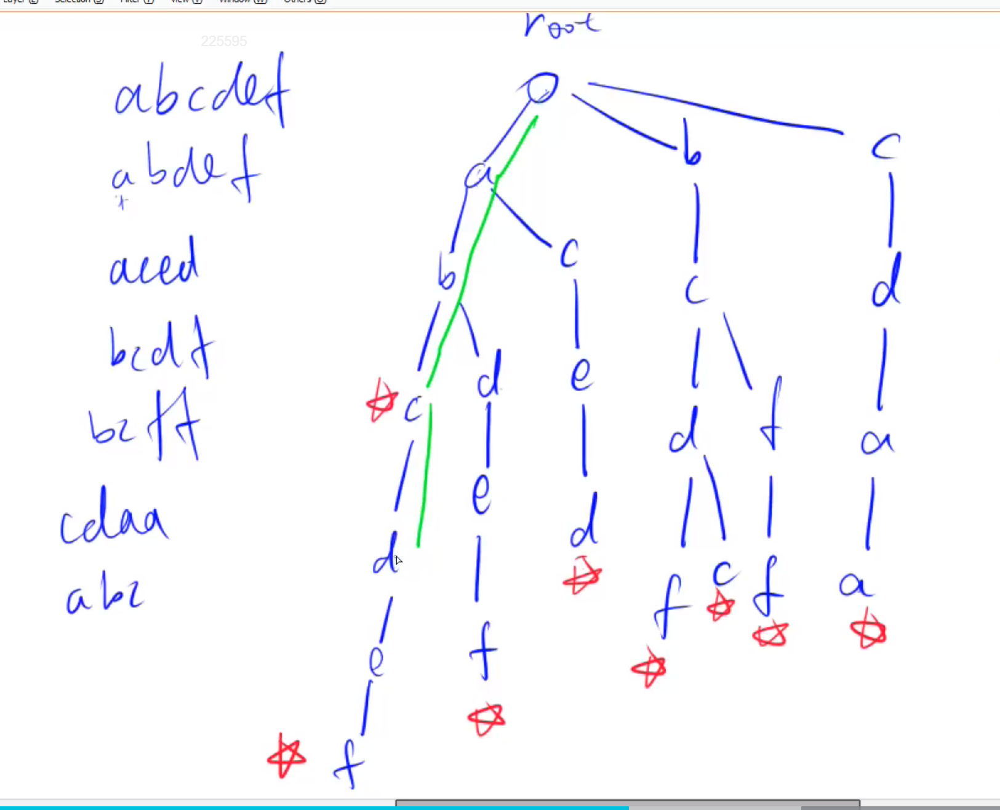
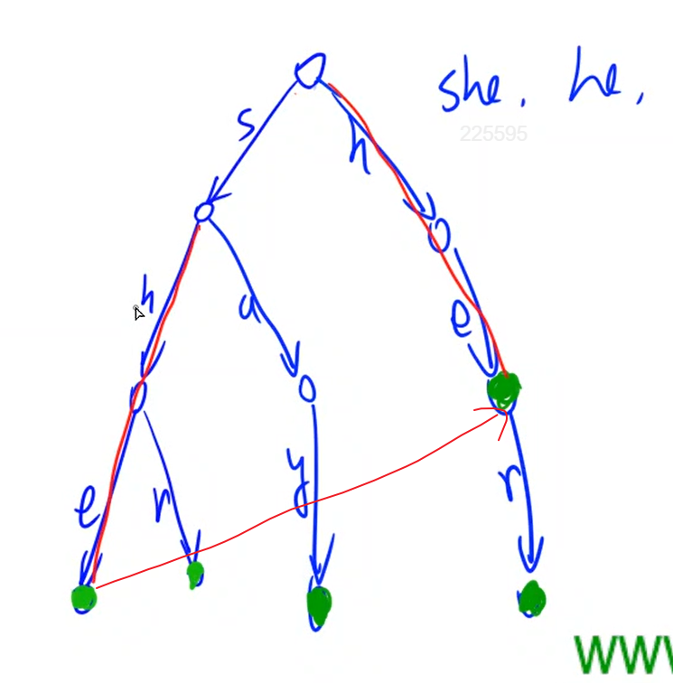

字符串hash -> <https://zhuanlan.zhihu.com/p/78418415>


- 暴力算法怎么做
- 如何去优化


---

**目录：**

- [Hash](#hash)
  - [存储结构](#存储结构)
    - [开放寻址法](#开放寻址法)
    - [拉链法](#拉链法)
  - [字符串哈希](#字符串哈希)
- [KMP o(n)](#kmp-on)
- [Trie树](#trie树)
- [AC自动机](#ac自动机)
- [Manacher](#manacher)


## Hash

作用：把一个庞大的空间**映射**到一个较小的空间（通常 0~~n）

操作：算法中的hash表通常只有**添加**和**查找**两个操作

> 如果要实现**删除**操作，可以开一个bool数组，进行打标记

数据范围：1e9 -> 1e5


步骤

- x mod 1e5
- 解决冲突


**模数**：100003 || 200003

一般而言，进行取模的数要取成**质数**，且要尽可能的离2的整次幂尽可能的远。

> 数学上是可以证明，这样取模数，冲突的概率最小


大于100000的第一个质数为**100003**

大于200000的第一个质数为**200003**


根据解决冲突的不同策略分为了两种方法：开放寻址法 && 拉链法


### 存储结构

#### 开放寻址法

只开了一个一维数组，没开链表。

经验上，这个一维数组的长度开到需求的2~~3倍

看`h(x) == k`处是否有人，如果有人就去下一个位置查看，直到找到第一个空位置




```cpp
#include<iostream>
#include<algorithm>
#include<cstring>

using namespace std;

const int N = 200010, mod = 200003, INF = 0x3f3f3f3f;

int h[N];

int find(int x){
    int t = (x % mod + mod) % mod;
    while(h[t] != INF && h[t] != x){
        t ++;
        if(t == mod) t = 0;
    }
    return t;
}

int main(){
    memset(h, 0x3f, sizeof h);
    
    int n;
    scanf("%d", &n);
    
    while(n --){
        char op[2];
        int x;
        scanf("%s%d", op, &x);
        
        if(*op == 'I') h[find(x)] = x;
        else{
            if(h[find(x)] == x) puts("Yes");
            else puts("No");
        }
    }
    
    return 0;
}
```


#### 拉链法

开一个 1e5 的数组，在每一个槽上拉一个链。



```cpp
#include<iostream>
#include<algorithm>
#include<cstring>

using namespace std;

const int N = 100010, mod = 100003;

int h[N], e[N], ne[N], idx;

void insert(int x){
    int k = (x % mod + mod) % mod;
    e[idx] = x;
    ne[idx] = h[k];
    h[k] = idx ++;
}

bool find(int x){
    int k = (x % mod + mod) % mod;
    for(int i = h[k]; i != -1; i = ne[i])
        if(e[i] == x)
            return true;
            
    return false;
}

int main(){
    int n;
    scanf("%d", &n);
    memset(h, -1, sizeof h);
    
    while(n --){
        char op[2];
        int x;
        scanf("%s%d", op, &x);
        
        if(*op == 'I') insert(x);
        else{
            if(find(x)) puts("Yes");
            else puts("No");
        }
    }
    
    return 0;
}
```


### 字符串哈希

字符串前缀哈希法

<https://www.acwing.com/problem/content/843/>


功能：

- 可以快速判断


步骤：

- 先预处理出所有前缀的哈希
- 如何定义某一个字符串的哈希值
  - 把字符串看作是**P进制**的数
  - 几个字母就看作几位
  - a -> 1 b -> 2 ... z -> 26


注意:

- 一般情况下，不能把某个字母映射成0 <- "a" == "aa"
- 这个hash，是假设我们的人品足够好，**不考虑冲突的情况**


通常取

p = 131 or 13331

q = $2^{64}$


用`unsigned long long`存储 h[], 如果溢出，自动对$2^{64}$取模了


```cpp
#include<iostream>
#include<algorithm>
#include<cstring>

using namespace std;

typedef unsigned long long ULL;

const int N = 100010, P = 131;

int n, m;
char s[N];
ULL h[N], p[N];

ULL get(int l, int r){
    return h[r] - h[l - 1] * p[r - l + 1];
}

int main(){
    scanf("%d%d", &n, &m);
    scanf("%s", s + 1);
    
    p[0] = 1;
    for(int i = 1; i <= n; i ++){
        h[i] = h[i - 1] * P + s[i];
        p[i] = p[i - 1] * P;
    }
    
    while(m --){
        int l1, r1, l2, r2;
        scanf("%d%d%d%d", &l1, &r1, &l2, &r2);
        
        if(get(l1, r1) == get(l2, r2)) puts("Yes");
        else puts("No");
    }
    return 0;
```


题目1：按字典序排序所有后缀

<https://www.acwing.com/problem/content/142/>


> 思路：
>
> 用i表示，从下标i开始的后缀
>
> 把比较字符串的时间复杂度从o(n) -> o(logn)
>
> 通过二分来确定相同前缀

## KMP o(n)

> 参考：
>
> <https://www.acwing.com/solution/content/4614/>

KMP 字符出下标习惯从 1 开始

S[N]：长串 

P[M]：短串 





**关键点：next数组** 

功能

- 找循环节

- 当 i - ne[i] 能整除 i 时，s[1 ~ i - ne[i]] 就是 s[1 ~ i] 的最小循环元。它的最大循环次数就是 $\frac{i}{i - ne[i]}$。其中 i - ne[i] 能整除 i 的条件是为了保证循环元每次重复的完整性
- 进一步，如果 i - ne[[ne[i]] 能整除 i ，那么 s[1 ~ i - ne[ne[i]]] 就是 s[1 ~ i] 的次小循环元。以此类推，可以找出所有可能的循环元
- 一个字符串的任意循环元长度必然是最小循环元长度的倍数


```cpp
// 暴力

for(int i = 1; i <= n; i ++){
    bool flag = true;
    for(int j = 1; j <= m; j ++)
        if(s[i + j - 1] != p[j]){
            flag = false;
            break;
        } 
}
```


模板题：<https://www.acwing.com/problem/content/description/833/>

```cpp
#include<iostream>

using namespace std;

const int N = 100010, M = 1000010;

int n, m;
char p[N], s[M]; // p 为子串，s 为母串
int ne[N];

int main(){
    cin >> n >> p + 1 >> m >> s + 1;
    
    // 求next数组的过程
    // ne[1] = 0;
    for(int i = 2, j = 0; i <= n; i ++){
        while(j && p[i] != p[j + 1]) j = ne[j];
        if(p[i] == p[j + 1]) j ++;
        ne[i] = j;
    }
    
    
    // KMP 匹配过程
    for(int i = 1, j = 0; i <= m; i ++){
        // j没有退回起点，重新开始匹配。并且母串和子串的下一个点无法匹配
        while(j && s[i] != p[j + 1]) j = ne[j];
        if(s[i] == p[j + 1]) j ++;
        if(j == n){
            // 匹配成功
            printf("%d ", i - n); // 输出每次匹配成功的起始位置，题目下标从0开始，再减1
            j = ne[j]; // 匹配成功再往回退一次
        }
    }
    return 0;
}
```


题目1：找**最小循环节**

<https://www.acwing.com/problem/content/description/143/>


> **思路**
>
> 如果循环节为 t <=> s[1, n - t] == s[t + 1, n]
>
> 找  最小的 t 
>
> => 找最大的n - t 
>
> => 找最长的一个和前缀相等的后缀
>
> => 即是next数组的定义
>
> => t == n - ne[n] 即为循环节的长度
>
> 同时如果 n % t == 0，即为循环节
>
> 如果 n % t == 0， 可能是存在很多循环段，但是最后一段只有一部分的情况


```cpp
#include<iostream>
#include<algorithm>
#include<cstring>

using namespace std;

const int N = 1000010;

int n;
char s[N];
int ne[N];

int main(){
    int T = 1;
    while(scanf("%d", &n), n){
        scanf("%s", s + 1);
        
        for(int i = 2, j = 0; i <= n; i ++){
            while(j && s[i] != s[j + 1]) j = ne[j];
            if(s[i] == s[j + 1]) j ++;
            ne[i] = j;
        }
        
        printf("Test case #%d\n", T ++);
        for(int i = 1; i <= n; i ++){
            int t = i - ne[i];
            
            if(i % t == 0 && i / t >= 2) 
                printf("%d %d\n", i, i / t);
        }
        puts("");
    }
    return 0;
}
```


题目2：KMP + DP 多状态的状态机

<https://www.acwing.com/problem/content/1054/>


> **思路**
>
> 一个字符串不包含一个子串 <=> 子串(长度m)的kmp上的j作为一个状态一直在跳，跳不到m
>
> => 一共有 m + 1 个状态， 每个状态向外连 26 条边
>
> 由于这道题的数据范围比较小，故不用初始化出连边的图


```cpp
#include<iostream>
#include<algorithm>
#include<cstring>

using namespace std;

const int N = 55, mod = 1e9 + 7;

int n, m;
char s[N];
int ne[N];
int f[N][N];

int main(){
    cin >> n >> s + 1;
    
    m = strlen(s + 1);
    
    for(int i = 2, j = 0; i <= m; i ++){
        while(j && s[i] != s[j + 1]) j = ne[j];
        if(s[i] == s[j + 1]) j ++;
        ne[i] = j;
    }
    
    f[0][0] = 1;
    for(int i = 0; i < n; i ++)
        for(int j = 0; j < m; j ++)
            for(char k = 'a'; k <= 'z'; k ++){
                // 枚举最后第 i + 1 位的字母
                int u = j;
                while(u && k != s[u + 1]) u = ne[u];
                if(k == s[u + 1]) u ++;
                if(u < m) f[i + 1][u] = (f[i + 1][u] + f[i][j]) % mod;
            }
            
    int res = 0;
    for(int i = 0; i < m; i ++) res = (res + f[n][i]) % mod;
    
    cout << res << endl;
    
    return 0;
}
```


## Trie树

功能：

- 高效**存储**和**查找**字符串**集合**的结构





<https://www.acwing.com/problem/content/description/837/>

```cpp
#include <iostream>

using namespace std;

const int N = 100010;

int son[N][26], cnt[N], idx; // 下标为0的点，即使根节点，也是空节点
char s[N];

void insert(char *s){
    int p = 0;
    for(int i = 0; s[i]; i ++){
        int u = s[i] - 'a';
        if(!son[p][u]) son[p][u] = ++ idx;
        p = son[p][u];
    }
    
    cnt[p] ++;
}

int query(char *s){
    int p = 0;
    for(int i = 0; s[i]; i ++){
        int u = s[i] - 'a';
        if(!son[p][u]) return 0;
        p = son[p][u];
    }
    
    return cnt[p];
}

int main(){
    int n;
    scanf("%d", &n);
    
    while (n -- )
    {
        char op[2];
        scanf("%s%s", op, s);
        if (*op == 'I') insert(s);
        else printf("%d\n", query(s));
    }

    return 0;
}
```


题目1：


## AC自动机


AC自动机 = Trie + kmp => **优化** => Trie图


next[i]:在p[]中，以p[i]结尾的后缀，能够匹配的从1开始的**非平凡**的前缀的最大长度





每次是用前一层的信息，来计算当前层的信息 ==> bfs


**模板**

<https://www.acwing.com/problem/content/description/1284/>

```cpp
#include<iostream>
#include<algorithm>
#include<cstring>
xzz
using namespace std;

const int N = 10010, S = 55, M = 1000010;

int n;
int tr[N * S][26], cnt[N * S], idx;
char str[M];
int q[N * S], ne[N * S];

void insert(){
    // trie树插入
    int p = 0;
    for(int i = 0; str[i]; i ++){
        int t = str[i] - 'a';
        if(!tr[p][t]) tr[p][t] = ++ idx; 
        p = tr[p][t];
    }
    cnt[p] ++; // 标记这个字符串的存在数量
}

void build(){
	// 根节点和第一层都是指向根节点，所以宽搜从第一层开始即可
    int hh = 0, tt = -1;
    for(int i = 0; i < 26; i ++)
        if(tr[0][i])
            q[++ tt] = tr[0][i];
    
    while(hh <= tt){
        int t = q[hh ++];     			// t <=> kmp中的i-1
        for(int i = 0; i < 26; i ++){
            int c = tr[t][i]; 			// c <=> kmp中的i
            if(!c) continue;			// 如果没有这个儿子，continue
            int j = ne[t];    			// j = ne[t] <=> kmp中的 j = ne[i-1]
            
            while(j && !tr[j][i]) j = ne[j];
            if(tr[j][i]) j = tr[j][i];  // tr[j][i] != 0 <=> kmp中p[i] == p[j+1]
            ne[c] = j;
            
            q[++ tt] = c;
        }
    }                
}

int main(){
	int T;
    scanf("%d", &T);
    
    while(T --){
        memset(tr, 0, sizeof tr);
        memset(cnt, 0, sizeof cnt);
        memset(ne, 0, sizeof ne);
        idx = 0;
        
        scanf("%d", &n);
        for(int i = 0; i < n; i ++){
            scanf("%s", str);
            insert();
        }
        
        build();
        
        scanf("%s", str);
        
        int res = 0;
        for(int i = 0, j = 0; str[i]; i ++){
			int t = str[i] - 'a';
            while(j && !tr[j][t]) j = ne[j]; // !tr[j][t] 表示j的下一个位置不存在s[i]
            if(tr[j][t]) j = tr[j][t];
            
            int p = j;
            while(p){
                res += cnt[p];
                cnt[p] = 0;
                p = ne[p];
            }
        }
        
       printf("%d\n", res);
    }
    
    return 0;
}
```


**AC自动机优化成Trie图的模板**

有种并查集路径压缩的感觉

```cpp
#include<iostream>
#include<algorithm>
#include<cstring>

using namespace std;

const int N = 10010, S = 55, M = 1000010;

int n;
int tr[N * S][26], cnt[N * S], idx;
char str[M];
int q[N * S], ne[N * S];

void insert(){
    int p = 0;
    for(int i = 0; str[i]; i ++){
        int t = str[i] - 'a';
        if(!tr[p][t]) tr[p][t] = ++ idx;
        p = tr[p][t];
    }
    cnt[p] ++;
}

void build(){
    int hh = 0, tt = -1;
    for(int i = 0; i < 26; i ++)
        if(tr[0][i])
            q[++ tt] = tr[0][i];
    
    while(hh <= tt){
        int t = q[hh ++];
        for(int i = 0; i < 26; i ++){
            int p = tr[t][i];
            if(!p) tr[t][i] = tr[ne[t]][i];
            else{
                ne[p] = tr[ne[t]][i];
                q[++ tt] = p;
            }        
        }
    }
}

int main(){
    int T;
    scanf("%d", &T);

    while(T --){
        memset(tr, 0, sizeof tr);
        memset(cnt, 0, sizeof cnt);
        memset(ne, 0, sizeof ne);
        idx = 0;

        scanf("%d", &n);
        for(int i = 0; i < n; i ++){
            scanf("%s", str);
            insert();            
        }

        build();

        scanf("%s", str);

        int res = 0;
        for(int i = 0, j = 0; str[i]; i ++){
            int t = str[i] - 'a';
            j = tr[j][t];

            int p = j;
            while(p && cnt[p] != -1){
                res += cnt[p];
                cnt[p] = -1;
                p = ne[p];
            }
        }

        printf("%d\n", res);
    }
    return 0;
}
```


题目1：修复DNA

<https://www.acwing.com/problem/content/1055/>


> `f[i][j]`
>
> 前i个字母，当前走到了AC自动机中的第j个位置的所有操作方案中，最少修改的字母数量


题目2：单词

<https://www.acwing.com/problem/content/1287/>


> 一个字符串出现的次数 == 所有满足要求的前缀个数
>
> 要求：后缀等于原字符串
>
> 
>
> 转化：
>
> 找到每个单词的出现次数 
>
> 找这个单词在其他单词中出现次数的总和
>
> 找这个单词在别的单词中的前缀的后缀是这个单词的次数的总和
>
> 假如我们要找到A这个单词的出现次数
>
> 假如一个单词B的前缀是以A结尾的后缀
>
> 那么它的next指向了 一个单词B的前缀是以A结尾的后缀那么它的next指向了的位置
> 无非两种
>
> 一：指向的就是单词A的结尾
> 二：指向的是以单词A结尾的的单词。
>
> 因为我们是一层一层推出来每个字符的next那么后面一层的next肯定指向的前面的一层，那么我们只需要倒着递推一遍
> 把所有以A结尾的串的数字加起来即可。


```cpp
#include<iostream>
#include<algorithm>
#include<cstring>

using namespace std;

const int N = 1000010;

int n;
int tr[N][26], f[N], idx;
int q[N], ne[N];
char str[N];
int id[210]; // 记录每个单词的节点下标

void insert(int x){
    int p = 0;
    for(int i = 0; str[i]; i ++){
        int t = str[i] - 'a';
        if(!tr[p][t]) tr[p][t] = ++ idx;
        p = tr[p][t];
        f[p] ++; // 统计的是所有前缀，所以路径上的每个点都要算上一次
    }
    id[x] = p;
}

void build(){
    int hh = 0, tt = -1;
    for(int i = 0; i < 26; i ++)
        if(tr[0][i])
            q[++ tt] = tr[0][i];

    while(hh <= tt){
        int t = q[hh ++];
        for(int i = 0; i < 26; i ++){
            int p = tr[t][i];
            if(!p) tr[t][i] = tr[ne[t]][i];
            else{
                ne[p] = tr[ne[t]][i];
                q[++ tt] = p;
            }
        }
    }
}

int main(){
    scanf("%d", &n);

    for(int i = 0; i < n; i ++){
        scanf("%s", str);
        insert(i);
    }

    build();

    for(int i = idx - 1; i >= 0; i --) f[ne[q[i]]] += f[q[i]];

    for(int i = 0; i < n; i ++) printf("%d\n", f[id[i]]);

    return 0;
}
```


## Manacher 

模板 洛谷P3850
```cpp
#include<iostream>
#include<algorithm>
#include<cstring>

using namespace std;

const int N = 22000005;

int n;
int cnt;
int p[N];
int mid, mr;
int ans;S

char c[N], s[N];

void build(){
    cin >> c + 1;

    n = strlen(c + 1);
    
    s[++ cnt] = '~', s[++ cnt] = '#';
    for(int i = 1; i <= n; i ++){
        s[++ cnt] = c[i];
        s[++ cnt] = '#';
    }

    s[++ cnt] = '!';
    
}

void solve(){
    for(int i = 2; i < cnt ; i ++) {
        if(i <= mr) p[i] = min(p[mid * 2 - i], mr - i + 1);
        else p[i] = 1;

        while(s[i - p[i]] == s[i + p[i]]) p[i] ++;

        if(i + p[i] > mr) {
            mr = i + p[i] - 1;
            mid = i;
        }

        ans = max(ans, p[i]);
    }

    cout << ans - 1 << endl;
}

int main(){
    ios::sync_with_stdio(false);
    cin.tie(nullptr);
    
    build();

    solve();

    return 0;
}   
```