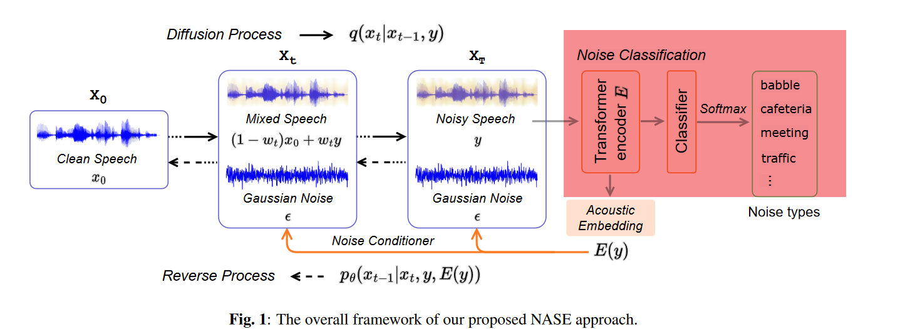
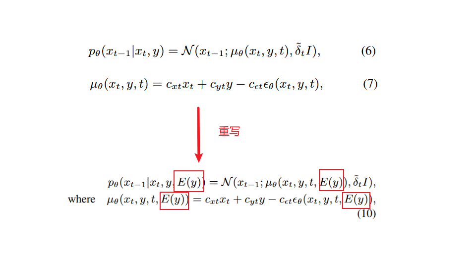
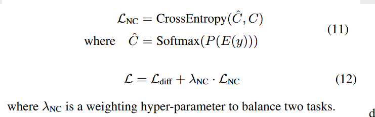

!!!abstract
    [NOISE-AWARE SPEECH ENHANCEMENT USING DIFFUSION PROBABILISTIC MODEL](https://arxiv.org/abs/2307.08029)

## INTRODUCTION

speech enhancement:

estimate clean speech signals from audio recordings that are corrupted by acoustic noises

语音增强（SE）旨在从被声学噪音破坏的音频记录中估算出干净的语音信号

通常作为应用的前端处理器

- speech recognition
- hearing aids
- speaker recognition

基于深度学习的语音增强（SE）大致可以分为两类

**这取决于用于估计从噪声语音到清晰语音的转换的标准**。

#### 第一类 --- 训练判别模型 discriminative models

以最小化噪声语音和清晰语音之间的距离

有监督学习 ==> 数据集有限 && 有限的模型容量 ==> 泛化能力差

> 1. **各种噪声类型**：
>    - **白噪声**：具有恒定的功率谱密度的噪声，听起来像是电视或收音机未调到任何频道时的声音。
>    - **高斯噪声**：其幅度遵循正态分布的噪声。
>    - **盐和椒噪声**：图像中随机出现的黑点和白点。
>    - **颜色噪声**：例如红噪声、粉红噪声等，它们的功率谱密度与频率有关。
> 2. **信噪比（SNR）**：
>    - 信噪比是一个度量，用于描述信号的强度与背景噪声的强度之间的比例。它通常以分贝（dB）为单位表示。
>    - 高的SNR意味着信号强度远高于背景噪声，因此信号更清晰。而低的SNR意味着噪声水平与信号水平相近，可能会导致信号难以分辨。
> 3. **混响**：
>
>   - 混响是*声音在室内反射后持续存在的现象*。当声音波从一个物体反射到另一个物体时，它们会重叠并持续一段时间，形成混响。
>    - 在音频处理中，混响可能会使语音或音乐听起来模糊不清。因此，在音频增强或语音识别中，消除混响是一个重要的步骤。

#### 第二类 --- 训练生成模型 generative models 

一些已经使用到语音增强的深度学习模型

- generative adversarial network (GAN) 
- variational autoencoder (VAE) 
- flow-based models
- diffusion probabilistic model --> 扩散概率模型

主要原理: 

The main principle of these approaches is to learn the inherent properties of clean speech,such as its temporal and spectral structure, which then serve as prior knowledge to infer clean speech from noisy input. Therefore, they focus on generating clean speech and are thus considered more robust to varying acoustic conditions in the real world. 

这些方法的主要原理是**学习干净语音的固有属性**，如时间和频谱结构，然后**将其作为先验知识，从噪声输入中推断出干净语音**。因此，这些方法专注于生成干净的语音，因此被认为更能适应现实世界中不同的声学条件。

对于未见测试噪声方面(unseen testing noises):

生成模型的性能优于判别模型

#### 引出本篇论文中的内容

However, these approaches fail to fully exploit the noise information inside input noisy speech [19], which could be instructive to the denoising process of SE, especially under unseen testing conditions.

这些方法未能充分利用输入噪声语音中的噪声信息，而这些信息对 SE 的去噪过程可能具有指导意义，尤其是在不可见的测试条件下。

提出**噪声感知语音增强（NASE）方法**

extracts noise-specific information to guide the reverse process of diffusion model

方法:提取特定噪声信息，以指导扩散模型的反向过程

在本文中，我们提出了一个噪声感知的语音增强（NASE）方法，该方法提取噪声特定的信息来指导扩散模型的反向过程。

具体来说，我们设计了一个噪声分类（NC）模型，并提取其声学嵌入作为指导反向去噪过程的噪声调节器。

有了这样的噪声特定信息，扩散模型可以针对嘈杂输入中的噪声成分，从而更有效地去除它。

同时，设计了一个**多任务学习方案，用于共同优化SE和NC任务**，旨在增强提取的**噪声调节器的噪声特异性**。我们的NASE**被证明是一个即插即用的模块**，可以推广到任何扩散SE模型以进行改进。实验验证了其在多个扩散骨干上的有效性，尤其是在未见过的测试噪声上。

## METHODOLOGY

### 1. Conditional Diffusion Probabilistic Model

考虑到现实世界的噪声通常不服从高斯分布 ==> 条件扩散概率模型

将噪声数据y同时纳入前向扩散和反向扩散的过程中.

使用一个动态权重 $w_t \in [0,1]$,进行从$x_0$到$x_t$的**插值**

每个潜在变量$x_t$包含三个项：

- 干净成分 $(1-w_t)*x_0$
- 噪声成分 $w_t*y$
- 高斯噪声 $\epsilon$

**前向过程**

扩散方程可以改写为

$$
\begin{align}
q(x_t|x_0, y) &= N(x_t;(1-w_t)\sqrt{\overline{\alpha_t}}x_0, + w_t\sqrt{\overline{\alpha_t}}y, \delta_tI)\\
其中\quad \delta_t &= (1-\overline{\alpha_t}) - w_t^2\overline{\alpha_t}
\end{align}
$$

其中$w_t$从$w_0=0$开始一直到$w_T \approx 1$,使得均值从干净语音的$x_0$变为带噪语音$y$

!!! question
    插值？

    "插值"（Interpolation）是一种数学技术，用于在已知的数据点之间估算未知的数据点。具体来说，这里使用了一个动态权重 \( w_t \in [0,1] \) 来进行从 \( x_0 \) 到 \( x_t \) 的线性插值。

    1. **动态权重 \( w_t \)**：这是一个在 0 和 1 之间变化的权重。当 \( w_t = 0 \) 时，我们完全依赖 \( x_0 \)（干净成分）；当 \( w_t = 1 \) 时，我们完全依赖 \( y \)（噪声成分）。

    2. **线性插值**：这意味着我们不仅仅依赖一个固定的 \( x_0 \) 或 \( y \)，而是根据 \( w_t \) 的值在 \( x_0 \) 和 \( y \) 之间进行平滑过渡。具体地，每个潜在变量 \( x_t \) 是由三个部分组成的：
        - 干净成分 \( (1-w_t) \times x_0 \)
        - 噪声成分 \( w_t \times y \)
        - 高斯噪声 \( \epsilon \)

    3. **扩散方程的改写**：这里的 \( q(x_t|x_0, y) \) 方程实际上是一个条件概率，表示在给定 \( x_0 \) 和 \( y \) 的条件下 \( x_t \) 的概率分布。这个分布是由 \( x_0 \)、\( y \) 和 \( \epsilon \) 线性插值得到的。

    插值在这里是一种权衡机制，允许模型在干净数据 \( x_0 \) 和噪声数据 \( y \) 之间进行平滑过渡，以生成更准确的 \( x_t \)。这是通过动态权重 \( w_t \) 来实现的，它在整个扩散过程中会发生变化。

**逆向过程**

从分布为$N(x_T, \sqrt{\overline{\alpha_T}}y. \delta_TI)的x_T$出发

逆向方程为

$$
\begin{align}
p_\theta(x_{t-1}|x_t,y) = N(x_{t-1};\mu_\theta(x_t, y, t), \overset{\sim}{\delta_t}I)
\end{align}
$$

其中$\mu_\theta(x_t, y, t)$是预测的$x_{t-1}$的均值

其中 $c_{xt}$, $c_{yt}$, $c_{\epsilon t}$是由ELBO优化准则得到的

具体参考

其中$C_t$作为真实数据，$L_{diff}$作为损失值进行训练

### 2. Noise Conditioner from Classification Module

利用噪声语音中的噪声特定信息来指导逆向去噪过程。

这是一个噪声分类模块，用BEATs初始化的Transformer编码器获得噪声的声学嵌入，再将声学嵌入被用作额外的条件器(辅助信息)指导逆向传播

**噪声分类模块（Noise Classification Module）**: 主要任务是识别和分类输入的噪声语音（noisy speech）中包含的噪声类型。这样做的目的是为了生成一个声学嵌入（acoustic embedding），这个嵌入将作为一个条件器（conditioner）用于后续的去噪过程。

**Transformer编码器（Transformer Encoder E）**: 噪声语音 y 通过这个编码器和一个线性分类器进行噪声类型分类。编码器的输出声学嵌入 E(y) 被用作噪声条件器。

**预训练的音频模型（BEATs）**: 为了更好地训练噪声分类模块并提取丰富的噪声特定信息，该方法使用了一个名为 BEATs 的预训练音频模型作为编码器 E。这个模型是在大规模的 AudioSet 数据集上预训练的。

!!! question
    什么是声学嵌入（Acoustic Embedding）？

    声学嵌入是一种数学表示，用于捕获音频信号（如噪声语音）中的关键特性。这种嵌入通常是一个高维向量，它包含了音频数据的重要信息，如频率、节奏、音高等，以及可能的噪声特性。

### 3. Multi-task Learning

辅助任务: 为了进一步增强声学嵌入 E(y) 的噪声特异性，引入了噪声分类作为一个辅助任务。这里的损失函数 \( L_{NC} \) 是交叉熵（CrossEntropy）。

\( \hat{C} \) 和 \( C \) 分别表示预测的概率分布和噪声类别标签。\( P \) 是用于分类的线性分类器。

这一部分主要讨论了多任务学习（Multi-task Learning）在提高声学嵌入（acoustic embedding）E(y)的噪声特异性方面的应用。
