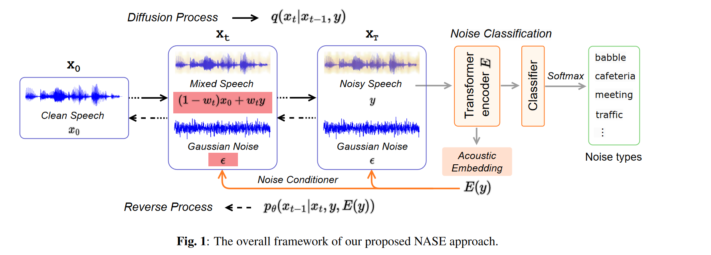
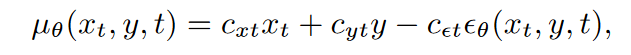
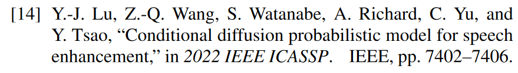
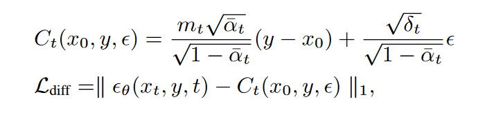

!!!abstract
    [NOISE-AWARE SPEECH ENHANCEMENT USING DIFFUSION PROBABILISTIC MODEL](https://arxiv.org/abs/2307.08029)

## 3.METHODOLOGY

### 3.1. Conditional Diffusion Probabilistic Model

考虑到现实世界的噪声通常不服从高斯分布 ==> 条件扩散概率模型

将噪声数据y同时纳入前向扩散和反向扩散的过程中.

使用一个动态权重 $w_t \in [0,1]$,进行从$x_0$到$x_t$的**插值**

每个潜在变量$x_t$包含三个项：
- 干净成分 $(1-w_t)*x_0$
- 噪声成分 $w_t*y$
- 高斯噪声 $\epsilon$

**前向过程**

扩散方程可以改写为

$$
\begin{align}
q(x_t|x_0, y) &= N(x_t;(1-w_t)\sqrt{\overline{\alpha_t}}x_0, + w_t\sqrt{\overline{\alpha_t}}y, \delta_tI)\\
其中\quad \delta_t &= (1-\overline{\alpha_t}) - w_t^2\overline{\alpha_t}
\end{align}
$$

其中$w_t$从$w_0=0$开始一直到$w_T \approx 1$,使得均值从干净语音的$x_0$变为带噪语音$y$

!!! question
    插值？

    "插值"（Interpolation）是一种数学技术，用于在已知的数据点之间估算未知的数据点。具体来说，这里使用了一个动态权重 \( w_t \in [0,1] \) 来进行从 \( x_0 \) 到 \( x_t \) 的线性插值。

    1. **动态权重 \( w_t \)**：这是一个在 0 和 1 之间变化的权重。当 \( w_t = 0 \) 时，我们完全依赖 \( x_0 \)（干净成分）；当 \( w_t = 1 \) 时，我们完全依赖 \( y \)（噪声成分）。

    2. **线性插值**：这意味着我们不仅仅依赖一个固定的 \( x_0 \) 或 \( y \)，而是根据 \( w_t \) 的值在 \( x_0 \) 和 \( y \) 之间进行平滑过渡。具体地，每个潜在变量 \( x_t \) 是由三个部分组成的：
        - 干净成分 \( (1-w_t) \times x_0 \)
        - 噪声成分 \( w_t \times y \)
        - 高斯噪声 \( \epsilon \)

    3. **扩散方程的改写**：这里的 \( q(x_t|x_0, y) \) 方程实际上是一个条件概率，表示在给定 \( x_0 \) 和 \( y \) 的条件下 \( x_t \) 的概率分布。这个分布是由 \( x_0 \)、\( y \) 和 \( \epsilon \) 线性插值得到的。

    插值在这里是一种权衡机制，允许模型在干净数据 \( x_0 \) 和噪声数据 \( y \) 之间进行平滑过渡，以生成更准确的 \( x_t \)。这是通过动态权重 \( w_t \) 来实现的，它在整个扩散过程中会发生变化。

**逆向过程**

从分布为$N(x_T, \sqrt{\overline{\alpha_T}}y. \delta_TI)的x_T$出发

逆向方程为

$$
\begin{align}
p_\theta(x_{t-1}|x_t,y) = N(x_{t-1};\mu_\theta(x_t, y, t), \overset{\sim}{\delta_t}I)
\end{align}
$$

其中$\mu_\theta(x_t, y, t)$是预测的$x_{t-1}$的均值

其中 $c_{xt}$, $c_{yt}$, $c_{\epsilon t}$是由ELBO优化准则得到的

具体参考

其中$C_t$作为真实数据，$L_{diff}$作为损失值进行训练

### 3.2. Noise Conditioner from Classification Module