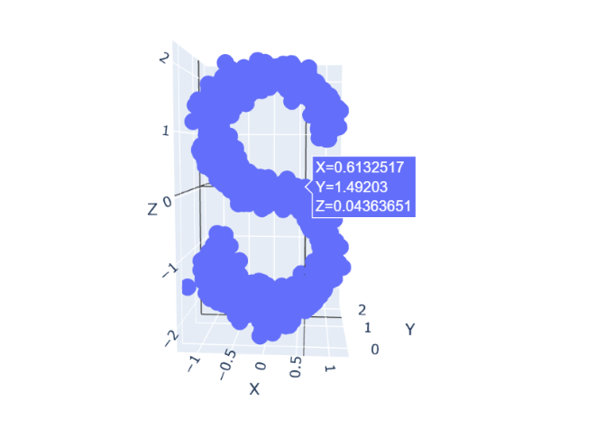
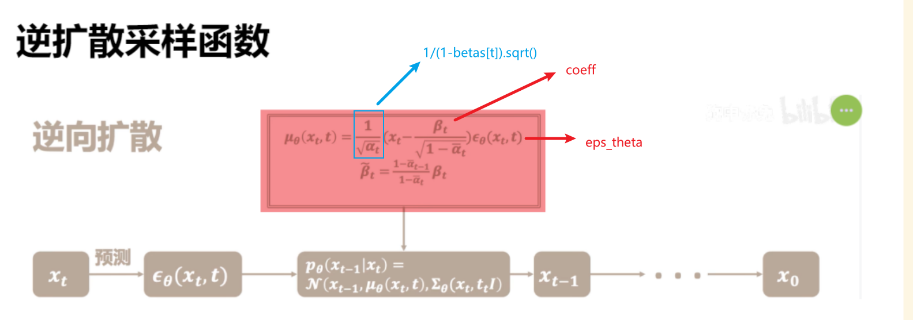
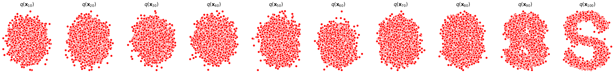

## 构造数据集

```py
from sklearn.datasets import make_s_curve
import torch

# 生成一个带噪音的S，只保留x轴和z轴，并将数据缩小10倍
s_curve, _ = make_s_curve(10**4, noise=0.1)
s_curve = s_curve[:,[0,2]]/10.0

dataset = torch.Tensor(s_curve).float()
print(dataset.shape)
```
**保留原图像的x轴和z轴**



## 确定超参数的值

```py
# 确定超参数的值
num_steps = 100  # 设置步数为100
betas = torch.linspace(-6,6,num_steps)  # 在-6和6之间生成100个等间距的数
betas = torch.sigmoid(betas)*(0.5e-2 - 1e-5)+1e-5  # 应用Sigmoid函数并进行缩放和偏移

alphas = 1-betas  # 计算alpha，通常与beta是互补的
alphas_prod = torch.cumprod(alphas,0)  # 计算alphas的累积乘积
alphas_prod_p = torch.cat([torch.tensor([1]).float(),alphas_prod[:-1]],0)  # 在累积乘积数组的开头添加一个1
alphas_bar_sqrt = torch.sqrt(alphas_prod)  # 计算alphas_prod的平方根
one_minus_alphas_bar_log = torch.log(1 - alphas_prod)  # 计算1 - alphas_prod的自然对数
one_minus_alphas_bar_sqrt = torch.sqrt(1 - alphas_prod)  # 计算1 - alphas_prod的平方根
```


**betas = torch.linspace(-6,6,num_steps)**:

$$
\text{betas}_i = -6 + \frac{(6 - (-6)) \times (i - 1)}{\text{num\_steps} - 1}, \quad i = 1, 2, \ldots, \text{num\_steps}
$$

**betas = torch.sigmoid(betas)*(0.5e-2 - 1e-5)+1e-5**: 

$$
\text{betas}_i' = \frac{1}{1 + e^{-\text{betas}_i}} \times (0.5 \times 10^{-2} - 10^{-5}) + 10^{-5}
$$

**alphas = 1-betas**: 

$$
\text{alphas}_i = 1 - \text{betas}_i'
$$

**alphas_prod = torch.cumprod(alphas,0)**: 

$$
\text{alphas\_prod}_i = \prod_{j=1}^{i} \text{alphas}_j
$$

**alphas_prod_p = torch.cat([torch.tensor([1]).float(),alphas_prod[:-1]],0)**: 

$$
\text{alphas\_prod\_p}_i = 
\begin{cases} 
1, & \text{if } i = 1 \\
\text{alphas\_prod}_{i-1}, & \text{otherwise}
\end{cases}
$$

**alphas_bar_sqrt = torch.sqrt(alphas_prod)**: 

$$
\text{alphas\_bar\_sqrt}_i = \sqrt{\text{alphas\_prod}_i}
$$

**one_minus_alphas_bar_log = torch.log(1 - alphas_prod)**: 

$$
\text{one\_minus\_alphas\_bar\_log}_i = \ln(1 - \text{alphas\_prod}_i)
$$

**one_minus_alphas_bar_sqrt = torch.sqrt(1 - alphas_prod)**: 

$$
\text{one\_minus\_alphas\_bar\_sqrt}_i = \sqrt{1 - \text{alphas\_prod}_i}
$$


!!! info 
    **sigmoid的缩放和偏移**

    betas = torch.sigmoid(betas)*(0.5e-2 - 1e-5)+1e-5  # 应用Sigmoid函数并进行缩放和偏移

    先在缩放中 -1e-5 之后整体 偏移 +1e-5 这样最大值仍然是0.5e-2

    Sigmoid 函数具有一些特性，使其非常适合用于缩放和偏移操作：

    Sigmoid 函数的特性
    1. **有界性（Boundedness）**: Sigmoid 函数的输出范围在 (0, 1) 之间。这意味着无论输入是什么，输出都会被“压缩”到这个范围内。
    2. **平滑性（Smoothness）**: Sigmoid 是一个平滑函数，这在梯度下降和其他优化算法中是有用的。

    缩放（Scaling）
    - 通过乘以一个常数（如 `(0.5e-2 - 1e-5)`），你可以进一步缩小 Sigmoid 函数的输出范围。这样，你可以得到一个非常小的正数，这在某些应用场景中可能是有用的。

    偏移（Offsetting）
    - 通过加上一个常数（如 `1e-5`），你可以将整个 Sigmoid 函数沿 y 轴上移。这样，输出值就不会是 0，这在避免数学错误（如除以零）时很有用。

    组合使用
    - 当你将缩放和偏移组合使用时，你可以得到一个非常灵活的函数，该函数能够将任何输入映射到一个非常具体的范围内。这在机器学习和统计建模中是非常有用的，因为它允许你更好地控制模型的行为。

## 确定前向过程中的采样值 $x_t$

$$
x_t = \sqrt{\overline{\alpha_t}}x_0 + \sqrt{1-\overline{\alpha_t}}I
$$

```py
# 计算出任意时刻的x采样值
def q_x(x_0, t):
    # 生成和x相同shape的tensor，其中元素是从标准正态分布中随机抽取的
    noise = torch.randn_like(x_0) 
    alphas_t = alphas_bar_sqrt[t]
    alphas_1_m_t = one_minus_alphas_bar_sqrt[t]
    
    # 在x[0]的基础上添加噪声
    x_t = alphas_t * x_0 + alphas_1_m_t * noise
    return x_t 
```

## 拟合逆向过程中的网络模型

```py
# 拟合逆向过程中的网络模型
class MLPDiffusion(nn.Module):
    def __init__(self, n_steps, num_units=128):
        super(SimpleMLPDiffusion, self).__init__()
        
        self.layer1 = nn.Linear(2, num_units)
        self.layer2 = nn.Linear(num_units, num_units)
        self.layer3 = nn.Linear(num_units, num_units)
        self.layer4 = nn.Linear(num_units, 2)
        
        self.relu = nn.ReLU()
        
        self.embedding1 = nn.Embedding(n_steps, num_units)
        self.embedding2 = nn.Embedding(n_steps, num_units)
        self.embedding3 = nn.Embedding(n_steps, num_units)
        
    def forward(self, x, t):    
        t_emb = self.embedding1(t) 
        x = self.layer1(x) + t_emb
        x = self.relu(x) 
        
        t_emb = self.embedding2(t)
        x = self.layer2(x) + t_emb
        x = self.relu(x)
        
        t_emb = self.embedding3(t)
        x = self.layer3(x) + t_emb
        x = self.relu(x)

        x = self.layer4(x)
        return x
```

## 损失函数

$$
\begin{align}
L_{simple} = E_{x_0 \sim q(x_0), \epsilon \sim N(0, I)}[\Vert\epsilon-\epsilon_\theta(\sqrt{\overline{\alpha_t}}x_0 + \sqrt{1-\overline{\alpha_t}}\epsilon, t)\Vert^2]
\end{align}
$$

```py
# 损失函数
def diffusion_loss_fn(model, x_0, alphas_bar_sqrt, one_minus_alphas_bar_sqrt, n_steps):
    # 对任意时刻t进行采样计算loss
    batch_size = x_0.shape[0]
    # 对一个batchsize样本生成随机的时刻t
    t = torch.randint(0, n_steps, size=(batch_size//2,))
    t = torch.cat([t, n_steps-1-t],dim=0)
    t = t.unsqueeze(-1)
    
    a = alphas_bar_sqrt[t] # x0的系数
    aml = one_minus_alphas_bar_sqrt[t] # eps的系数
    e = torch.randn_like(x_0) # 生成随机噪音eps
    x = x_0*a+e*aml # 构造模型的输入
    
    # 送入模型，得到t时刻的随机噪声预测值
    output = model(x, t.squeeze(-1))
    # 与真实噪声一起计算误差，求平均值
    return (e - output).square().mean()
```

!!! note
    1. `t = torch.randint(0, n_steps, size=(batch_size//2,))`：
        - 使用PyTorch的`torch.randint`函数生成一个整数张量（tensor），其中的整数随机地选自`[0, n_steps)`区间。
        - `size=(batch_size//2,)`表示生成的随机整数的数量是`batch_size`的一半
    2. `t = torch.cat([t, n_steps-1-t], dim=0)`：
        - 使用`torch.cat`函数沿着第0维（`dim=0`）连接两个张量：一个是`t`，另一个是`n_steps-1-t`。
        - `n_steps-1-t`实际上是对`t`进行了一个"翻转"，使得新生成的时刻与原始时刻互补。
        - **这样做的目的通常是为了在同一个批量中有不同的时间步长，可能用于某种对称或平衡的考虑。**

    3. `t = t.unsqueeze(-1)`：
        - 使用`unsqueeze`函数在最后一个维度（`-1`表示最后一个维度）增加一个维度。
        - 这通常是为了使张量的形状与其他需要进行矩阵运算的张量兼容。

## 逆扩散采样函数



```py
# 逆扩散采样函数
def p_sample_loop(model,shape,n_steps,betas,one_minus_alphas_bar_sqrt):
    # 从x_T得到x_T...x_0
    cur_x = torch.randn(shape)
    x_seq = [cur_x]
    for i in reversed(range(n_steps)):
        cur_x = p_sample(model,cur_x,i,betas,one_minus_alphas_bar_sqrt)
        x_seq.append(cur_x)
    return x_seq

def p_sample(model,x,t,betas,one_minus_alphas_bar_sqrt):
    # 从x_t得到x_{t-1}
    t = torch.tensor([t])
    
    coeff = betas[t] / one_minus_alphas_bar_sqrt[t]
    
    eps_theta = model(x,t)
    
    mean = (1/(1-betas[t]).sqrt())*((x-coeff)*eps_theta)
    
    z = torch.randn_like(x)
    sigma_t = betas[t].sqrt()
    
    sample = mean + sigma_t * z # 平均值 + 标准差
    return (sample)
```

## 训练模型

```py
# 训练模型
print('Training model...')
batch_size = 128
dataloader = torch.utils.data.DataLoader(dataset,batch_size=batch_size,shuffle=True)
num_epoch = 200

model = MLPDiffusion(num_steps)#输出维度是2，输入是x和step
optimizer = torch.optim.Adam(model.parameters(),lr=1e-3)

for t in range(num_epoch):
    for idx, batch_x in enumerate(dataloader):
        loss = diffusion_loss_fn(model, batch_x, alphas_bar_sqrt, one_minus_alphas_bar_sqrt, num_steps)
        optimizer.zero_grad()
        loss.backward()
        # 对模型参数的梯度进行裁剪，以防梯度爆炸问题
        torch.nn.utils.clip_grad_norm_(model.parameters(), 1.)
        optimizer.step()
        
    if(t % 100 == 0):
        print(loss)
        x_seq = p_sample_loop(model, dataset.shape, num_steps, betas, one_minus_alphas_bar_sqrt)
        
        fig,axs = plt.subplots(1, 10, figsize=(28, 3))
        for i in range(1,11):
            cur_x = x_seq[i * 10].detach()
            axs[i-1].scatter(cur_x[:, 0], cur_x[:, 1], color='red',edgecolor='white')
            axs[i-1].set_axis_off()
            axs[i-1].set_title('$q(\mathbf{x}_{'+str(i*10)+'})$')
```

!!! question
    torch.nn.utils.clip_grad_norm_(model.parameters(), 1.) ?

    在深度学习中，梯度爆炸是一个常见的问题，尤其在处理序列数据或者复杂网络结构时。梯度爆炸就是在训练过程中，模型的梯度变得非常大，以至于更新后的模型参数值变得不稳定，这可能导致模型无法收敛。

    为了解决这个问题，一种常见的做法是进行梯度裁剪（Gradient Clipping）。梯度裁剪的基本思想是设置一个阈值，当计算出的梯度值超过这个阈值时，就将其压缩回这个范围。

    具体来说，在 PyTorch 中，`torch.nn.utils.clip_grad_norm_`函数就是用于进行梯度裁剪的。这个函数接收两个主要参数：

    1. `model.parameters()`: 这是模型的所有可训练参数。
    2. `1.`: 这是设置的梯度裁剪阈值。

    该函数的工作原理如下：

    1. 首先，它会计算所有模型参数的梯度的范数（通常是 2-范数）。
    2. 然后，与设定的阈值（在这里是 1）进行比较。
    3. 如果梯度的范数大于这个阈值，那么就会按比例缩小所有梯度，使得范数等于这个阈值。

    通过这种方式，`torch.nn.utils.clip_grad_norm_`确保了所有参数的梯度范数不会超过设定的阈值，从而避免了梯度爆炸问题。这通常有助于稳定模型的训练过程。


## 完整code

```py
import matplotlib.pyplot as plt
from sklearn.datasets import make_s_curve
import torch
import torch.nn as nn

# 生成一个带噪音的S，只保留x轴和z轴，并将数据缩小10倍
s_curve, _ = make_s_curve(10**4, noise=0.1)
s_curve = s_curve[:,[0,2]]/10.0

dataset = torch.Tensor(s_curve).float()
print(dataset.shape)

# 确定超参数的值
num_steps = 100  # 设置步数为100
betas = torch.linspace(-6,6,num_steps)  # 在-6和6之间生成100个等间距的数
betas = torch.sigmoid(betas)*(0.5e-2 - 1e-5)+1e-5  # 应用Sigmoid函数并进行缩放和偏移

alphas = 1-betas  # 计算alpha，通常与beta是互补的
alphas_prod = torch.cumprod(alphas,0)  # 计算alphas的累积乘积
alphas_prod_p = torch.cat([torch.tensor([1]).float(),alphas_prod[:-1]],0)  # 在累积乘积数组的开头添加一个1
alphas_bar_sqrt = torch.sqrt(alphas_prod)  # 计算alphas_prod的平方根
one_minus_alphas_bar_log = torch.log(1 - alphas_prod)  # 计算1 - alphas_prod的自然对数
one_minus_alphas_bar_sqrt = torch.sqrt(1 - alphas_prod)  # 计算1 - alphas_prod的平方根

# 计算出任意时刻的x采样值
def q_x(x_0, t):
    # 生成和x相同shape的tensor，其中元素是从标准正态分布中随机抽取的
    noise = torch.randn_like(x_0)
    alphas_t = alphas_bar_sqrt[t]
    alphas_1_m_t = one_minus_alphas_bar_sqrt[t]

    # 在x[0]的基础上添加噪声
    x_t = alphas_t * x_0 + alphas_1_m_t * noise
    return x_t


# 拟合逆向过程中的网络模型
class MLPDiffusion(nn.Module):
    def __init__(self, n_steps, num_units=128):
        super(MLPDiffusion, self).__init__()

        self.layer1 = nn.Linear(2, num_units)
        self.layer2 = nn.Linear(num_units, num_units)
        self.layer3 = nn.Linear(num_units, num_units)
        self.layer4 = nn.Linear(num_units, 2)

        self.relu = nn.ReLU()

        self.embedding1 = nn.Embedding(n_steps, num_units)
        self.embedding2 = nn.Embedding(n_steps, num_units)
        self.embedding3 = nn.Embedding(n_steps, num_units)

    def forward(self, x, t):
        t_emb = self.embedding1(t)
        x = self.layer1(x) + t_emb
        x = self.relu(x)

        t_emb = self.embedding2(t)
        x = self.layer2(x) + t_emb
        x = self.relu(x)

        t_emb = self.embedding3(t)
        x = self.layer3(x) + t_emb
        x = self.relu(x)

        x = self.layer4(x)
        return x


# 损失函数
def diffusion_loss_fn(model, x_0, alphas_bar_sqrt, one_minus_alphas_bar_sqrt, n_steps):
    # 对任意时刻t进行采样计算loss
    batch_size = x_0.shape[0]
    # 对一个batchsize样本生成随机的时刻t
    t = torch.randint(0, n_steps, size=(batch_size // 2,))
    t = torch.cat([t, n_steps - 1 - t], dim=0)
    t = t.unsqueeze(-1)

    a = alphas_bar_sqrt[t]  # x0的系数
    aml = one_minus_alphas_bar_sqrt[t]  # eps的系数
    e = torch.randn_like(x_0)  # 生成随机噪音eps
    x = x_0 * a + e * aml  # 构造模型的输入

    # 送入模型，得到t时刻的随机噪声预测值
    output = model(x, t.squeeze(-1))
    # 与真实噪声一起计算误差，求平均值
    return (e - output).square().mean()


# 逆扩散采样函数
def p_sample_loop(model,shape,n_steps,betas,one_minus_alphas_bar_sqrt):
    # 从x_T得到x_T...x_0
    cur_x = torch.randn(shape)
    x_seq = [cur_x]
    for i in reversed(range(n_steps)):
        cur_x = p_sample(model,cur_x,i,betas,one_minus_alphas_bar_sqrt)
        x_seq.append(cur_x)
    return x_seq

def p_sample(model,x,t,betas,one_minus_alphas_bar_sqrt):
    # 从x_t得到x_{t-1}
    t = torch.tensor([t])
    
    coeff = betas[t] / one_minus_alphas_bar_sqrt[t]
    
    eps_theta = model(x,t)
    
    mean = (1/(1-betas[t]).sqrt())*((x-coeff)*eps_theta)
    
    z = torch.randn_like(x)
    sigma_t = betas[t].sqrt()
    
    sample = mean + sigma_t * z # 平均值 + 标准差
    return (sample)

# 训练模型
print('Training model...')
batch_size = 128
dataloader = torch.utils.data.DataLoader(dataset,batch_size=batch_size,shuffle=True)
num_epoch = 200

model = MLPDiffusion(num_steps)#输出维度是2，输入是x和step
optimizer = torch.optim.Adam(model.parameters(),lr=1e-3)

for t in range(num_epoch):
    for idx, batch_x in enumerate(dataloader):
        loss = diffusion_loss_fn(model, batch_x, alphas_bar_sqrt, one_minus_alphas_bar_sqrt, num_steps)
        optimizer.zero_grad()
        loss.backward()
        # 对模型参数的梯度进行裁剪，以防梯度爆炸问题
        torch.nn.utils.clip_grad_norm_(model.parameters(), 1.)
        optimizer.step()
        
    if(t % 100 == 0):
        print(loss)
        x_seq = p_sample_loop(model, dataset.shape, num_steps, betas, one_minus_alphas_bar_sqrt)
        
        fig,axs = plt.subplots(1, 10, figsize=(28, 3))
        for i in range(1,11):
            cur_x = x_seq[i * 10].detach()
            axs[i-1].scatter(cur_x[:, 0], cur_x[:, 1], color='red',edgecolor='white')
            axs[i-1].set_axis_off()
            axs[i-1].set_title('$q(\mathbf{x}_{'+str(i*10)+'})$')
```

**效果图**




!!! warning "Reference"

    - 论文 
        -  [Deep Unsupervised Learning using Nonequilibrium Thermodynamics](https://proceedings.mlr.press/v37/sohl-dickstein15.html)
        -  [Denoising Diffusion Probabilistic Models](https://proceedings.neurips.cc/paper/2020/hash/4c5bcfec8584af0d967f1ab10179ca4b-Abstract.html)
    - 视频
        - [大白话AI | 图像生成模型DDPM | 扩散模型 | 生成模型 | 概率扩散去噪生成模型](https://www.bilibili.com/video/BV1tz4y1h7q1/?spm_id_from=333.999.0.0)
        - [54、Probabilistic Diffusion Model概率扩散模型理论与完整PyTorch代码详细解读](https://www.bilibili.com/video/BV1b541197HX/?spm_id_from=333.999.0.0)
        - [扩散模型/Diffusion Model原理讲解](https://www.bilibili.com/video/BV1PY411Z74Z/?spm_id_from=333.1007.top_right_bar_window_custom_collection.content.click&vd_source=664d223fe65c6706d11206b7416f5b92)
      
    - 文章
        - [Diffusion Model原理解析](https://zhuanlan.zhihu.com/p/539283420)